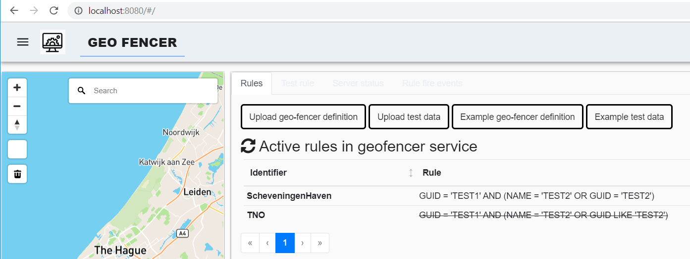
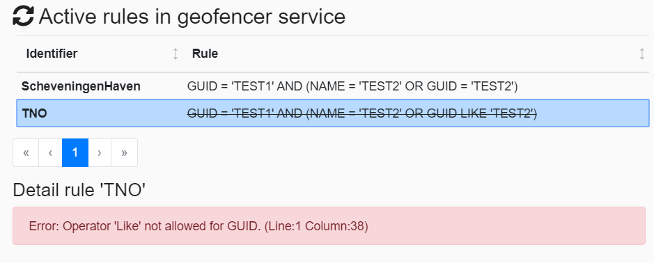
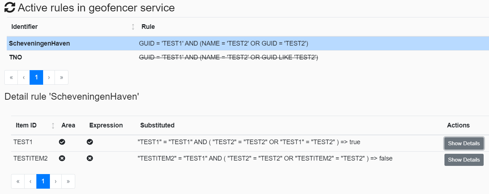
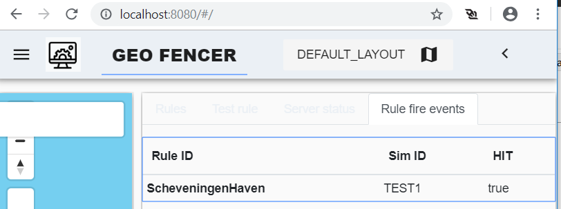

# Geo-fencer service
The geo-fencer service monitors all simulation entities on the KAFKA bus. When the service is provided with a geo-fencer definition a message will be put on KAFKA is a rule is match. A rule consist of a geographic area and a condition. 

# Documentation
* [Debugging Geofencer Service](documentation/DebuggingGeoFencerService.md)
* [Rule evaluation with ANTLR](documentation/ANTLR.md)
* [AVRO schema's](documentation/AvroSchemas.md)
* [REST management API](documentation/RestManagementInterface.md)
* [Geofencer definition](documentation/GeofencerDefinition.md)
* [Geofencer rule](documentation/GeofencerRule.md)
* [Geofencer geometry](documentation/GeofencerGeometry.md)
### Configuration

By default the configuration file ' geofencer-config.json' is used. This can be changed to an other config file with the --config option.

`Command line option: 'npm run start:prod -- --help'`

# Project layout

* docker: Script to generate an docker image and script to start and manage docker container.
* documentation: Documentation for project
* packages\dashboard: Angular web application for monitoring the GeoFencer service (uses an REST interface to communicate with service)
* packages\server: The typescript GeoFencer service application
* schemas: The AVRO schema's used on the KAFKA bus
* TestRestCall: CURL application to test the service REST interface

The directory "packages" contains two Visual Studio Code workspace files.

# REST Interface

The service uses the NEST.JS framework for REST. This is a code-first approach, the swagger (OpenApi def) is generated  from the meta data in the code. When the service is running the auto generated swagger definition can be downloaded (http://localhost:7890/api-json). The WEB client uses this to generate a client interface. 

## Web interface

The web interface can be used to monitor and test the geo-fencer service. The KAFKA bus is used to configure the geo-fencer definition and monitor simulation entities. For testing it is also possible to use the button on the first tab (send directly to server). Two example files can be downloaded as reference.

In the first tab all active rules are shown (in this example 2). 

When a rule is crossed out the rule is invalid and will be ignored during evaluation. By selecting the rule the error message is shown.

When selecting a rule the current state of each simulated entity object can be checked. The rule consist of two part, the first is the geographical area, the second is the expression. If both are valid a event is fired on the kafka bus.

In the "Test rule" tab it possible to test a rule. When the rule is invalid the error will be shown.

In the "Rule fire events" the last 30 fired rules are shown. Important: the view has no history, it only show the events from the moment the web-application was openend!
``