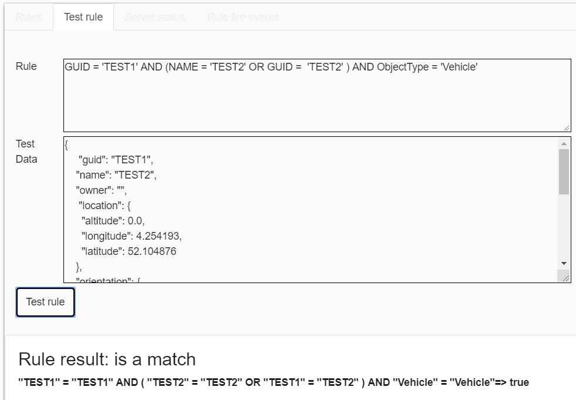

# Geo-fencer service
The geo-fence service generates kafka topic notifications when a simulated entity matches a rule that is defined in the geo-fencer definition. The geo-fencer definition uses a named GeoJSON format. 

### Configuration

By default the configuration file ' geofencer-config.json' is used. This can be changed to an other config file with the --config option.

`Command line option: 'npm run start:prod -- --help'`

## Web interface

The web interface can be used to monitor and test the geo-fencer service. The KAFKA bus is used to configure the geo-fencer definition and monitor simulation entities. For testing it is also possible to use the button on the first tab (send directly to server). Two example files can be downloaded as reference.

In the first tab all active rules are shown (in this example 2). 

When a rule is crossed out the rule is invalid and will be ignored during evaluation. By selecting the rule the error message is shown.

When selecting a rule the current state of each simulated entity object can be checked. The rule consist of two part, the first is the geographical area, the second is the expression. If both are valid a event is fired on the kafka bus.

In the "Test rule" tab it possible to test a rule. When the rule is invalid the error will be shown.

In the "Rule fire events" the last 30 fired rules are shown. Important: the view has no history, it only show the events from the moment the web-application was openend!
