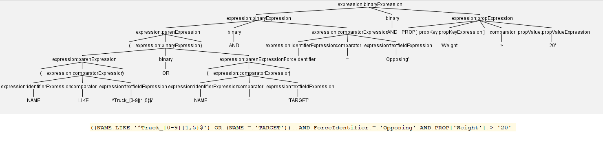
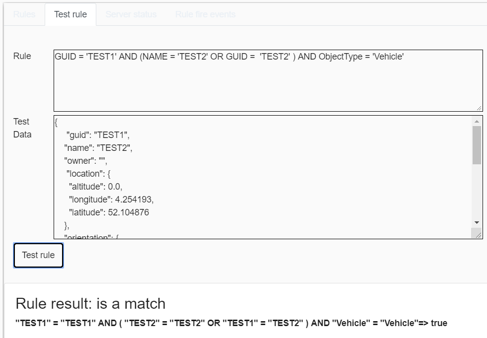

# ANTLR

The ANTLR (https://www.antlr.org/) is used to parse the rules in the geofencer definition. The rule is grammar is described in the file ' packages\server\src\antlr\GeoFencerExpression.g4'.  The code generator (https://github.com/tunnelvisionlabs/antlr4ts) is used to generate typescript code to parse the rule. With a visitor pattern the rule can be evaluated. If ANTLR generated code only validates if the rule is according to the .g4 file. In the visitor pattern implementation validation must be done if constructions are allowed (e.d. NAME > 10 doesn't make sense).

## Generate ANTLR typescript

In ' \packages\server' run 'npm run antlr4ts' (only needed when .g4 file changes).

## Rule evaluation

A geofencer fule is parsed with the generated code and an AST tree is generated, in the example below the rule  ((NAME LIKE '^Truck_[0-9]{1,5}$') OR (NAME = 'TARGET'))  AND ForceIdentifier = 'Opposing' AND PROP['Weight'] > '20'  is converted to the following tree:

 The rule logic is implemented in the file '\packages\server\src\models\geofencer\GeoFencerExpressionVisitorImpl.ts'.  The visitor pattern calls all the tree nodes. Each leaf with tree three children reduced to true of false. Finally the root node return true or false.

## Testing rule

In the web interface it is possible to test a rule. See the "Test rule" tab. When the rule is invalid the error will be shown.

## Debugging ANTLR

The (free) IntelliJ IDEA has an excellent ANTLR plugin.  Select the ' expression' rule in the .g4 file and select in the context menu 'Test Rule expression' . In the ANTLR Preview tab a rule can be specified. The rule is converted to a AST tree view on the fly and ANLT parse errors are shown in red. Modifications in the .g4 file are updated automatically.

