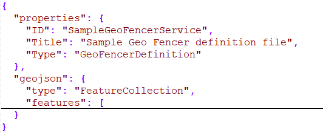
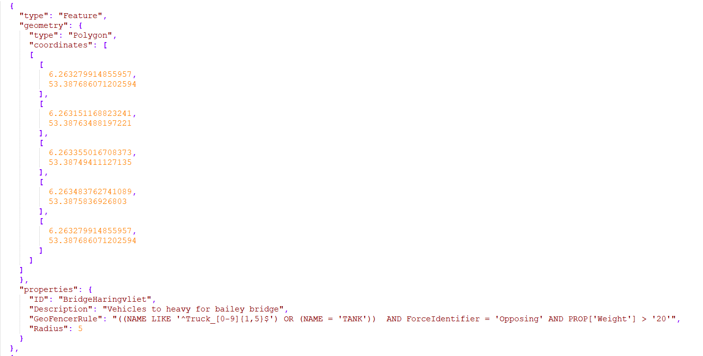

# Geofencer definition

Geofencer rules must be defined in a named GeoJSON file. The named GeoJSON adds an envelop around the GeoJSON. 

Used header properties:

* ID => Unique ID for the file
* Title => Shown in GUI and log files
* Type => Must have the value 'GeoFencerDefinition'

Each feature within the GeoJSON can contain a rule which shall be monitored by the geofencer. 

A rule consist of the following elements:

* geometry 
  * The geometry can be a Point (see also radius property) or a Polygon
* properties
  * ID => Unique ID for the rule, used when rule fired is reported
  * Description => Used for management website and log files
  * GeoFencerRule => See section [Geofencer rule](documentation/GeofencerRule.md)

## Management web interface and geofencer definition

In the upload tab of the management web interface an example Geofencer definition file can be download.