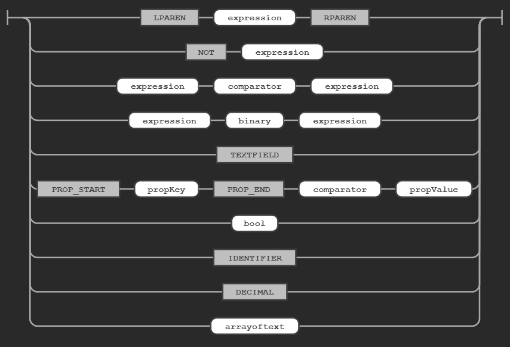
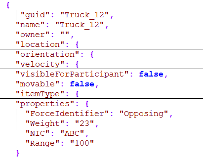

# Geofencer rule

For technical background see: [Rule evaluation with ANTLR](documentation/ANTLR.md)

All [Simulation Items](documentation/AvroSchemas.md) (representing a visual entity inside the simulation world) published on the KAFKA bus are validated against the geofencer rules defined in the [geofencer definition](documentation/GeofencerDefinition.md)

A Geofencer rule consist of the parts:

* Geometry part 
* Expression part

## Rule geometry

See section [Geofencer geometry](documentation/GeofencerGeometry.md)

## Rule expression

Each simulation item is evaluated against the following schema:

## Comparator operator

For numbers the following comparators are allowed:  '>' , '>=' , '<' ,'<=', '=' 

For text the following comparators are allowed:  'LIKE', '=', 'IN'

The LIKE operator is a regular expression, where '=' is a text compare (case insensative)

Use 'NOT' to invert a operator.

## Binary and paren operator

The 'AND' and 'OR' operator are supported. Expression can be grouped with '(' and ')'. 

Example: ((NAME = 'OBJ1') OR (NAME = 'OBJ2')) AND GUID = 'ABCDEF'

## IDENTIFIER check

Recognized identifiers:

* Name
* Guid
* ObjectType
* ForceIdentifier

## PROPERTY check

Each simulation item can have a property bag. The rule can check against property values. For example

`PROP['Weight'] > '10'`

The compare value must be quoted. When the compare operator is  '>' , '>=' , '<' ,'<=', '='  the value shall be converted to a number, else a text compare is done. When the property doesn't exists false is returned. 

