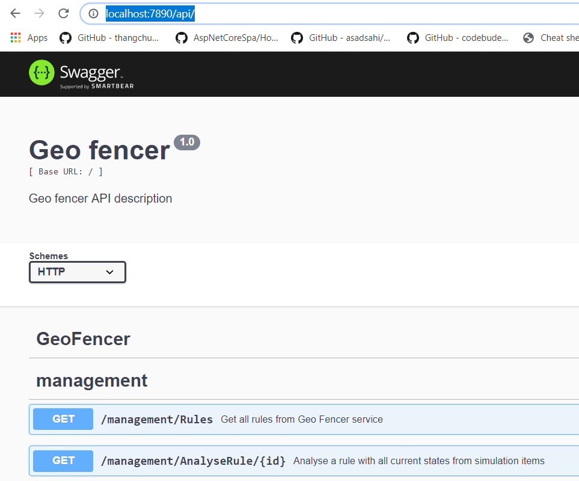

# GeoFencer REST Interface

To manage and monitor the geofencer service a REST API is specified. The OpenApi (aka swagger) is used to specify the server API (https://swagger.io/).  The NestJS framework (https://nestjs.com/) is used for hosting the REST. A code-first approach is used where in de source code (\packages\server\src\controllers\\*) the API is specified with annotations. Based on this information the NestJS framework can generate a swagger definition file. When the geofencer service is running the API defintion can be downloaded on http://localhost:7890/api-json.

The management portal uses the REST API interface, and for most circumstances this will be the only application that uses the API. 

Also (when geofencer service is running) the REST API documentation can be viewed on http://localhost:7890/api/ (and also test REST calls)

## Web management site

The management portal (vue.js) uses the swagger definition to generate HTTP API client in typescript. The swagger code generator is used to do this (https://swagger.io/tools/swagger-codegen/). In the directory ''\packages\dashboard\swagger_codegenerator' the typescript API client can be generated with script GenerateCodeWithDocker.bat. The script start a docker environment with the swagger code generator. Downloads the swagger definition form the geofencer (the geofencer service must be up and running). An based on this file generates the code. The generated typescript code is placed in 'packages\dashboard\src\generated_rest_api' .

Or use the command: `NPM run generate-rest-client`'

## KAFKA messages

The REST interface use purely for monitoring and testing. The geofencer is event driven with events from the KAFKA bus and can work completely without the REST API interface.